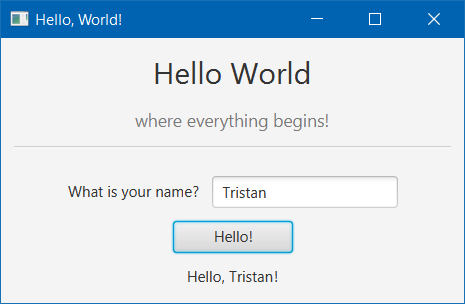

# EasyFXML
A tiny framework to combine the convenience of _Spring Boot_ and _JavaFX_ together

[](https://search.maven.org/artifact/moe.tristan/easyfxml/3.1.6/jar)

[](https://circleci.com/gh/Tristan971/EasyFXML)
[](https://codeclimate.com/github/Tristan971/EasyFXML/maintainability)
[](https://codeclimate.com/github/Tristan971/EasyFXML/test_coverage)
[](https://snyk.io/test/github/tristan971/easyfxml?targetFile=pom.xml)

## Features

- Declarative and type-safe definition and usage of visual components
- Fully compatible with Spring Boot 2, Java 11+ and the module path
- Easier asynchronous management of components' lifecycle
- Built with first-class support for FXML files
- No specific configuration needed

## Basics

The idea of EasyFXML is to leverage the current MVC model for front-end components and apply it to _JavaFX_ to enable proper 
separation of concerns and lifecycle management in applications.

There are two core parts defining a visual element (an `FxmlNode`, hereafter):
- Its view, an FXML file described by an `FxmlFile`, that is, a `String` supplier that is in charge of providing the path to the view file as a classpath resource.
  - The reason behind not simply using a `String`, `File` or `Path` is to allow for dynamic management of view files (OSGi, dynamic choice FXML file to load...)
- Its controller, a Spring Bean implementing `FxmlController`

## Getting started
###### This section is mostly a simplified version of the [Hello World](./easyfxml-samples/easyfxml-sample-hello-world) if you want to check it out for yourself

Let's see how building a very minimal greeter window, like follows, would work:



For this you will need:
- A component to load (the aforementionned Hello World one) along with its controller
- An entrypoint for the UI
- A main class

##### Component ([`FxmlNode`](./easyfxml/src/main/java/moe/tristan/easyfxml/api/FxmlNode.java))
```java
@Component
public class HelloComponent implements FxmlNode {
    
    @Override 
    public FxmlFile getFile() {
        return () -> "my/package/view/hello/HelloView.fxml"; 
        // component lies in `my.package.view.hello` package
    }   // and its FXML view file is `HelloView.fxml`

    @Override
    public Class<? extends FxmlController> getControllerClass() {
        return HelloController.class; 
        // Its controller class is `HelloController`
    }

}
```

##### Controller ([`FxmlController`](./easyfxml/src/main/java/moe/tristan/easyfxml/api/FxmlController.java))
```java
@Component
public class HelloController implements FxmlController {

    @FXML 
    private TextField userNameTextField;
    
    @FXML 
    private Button helloButton;
    
    @FXML 
    private HBox greetingBox;
    
    @FXML 
    private Label greetingName;

    @Override
    public void initialize() { // called once loading is fully done
        greetingBox.setVisible(false);
        greetingName.textProperty().bind(userNameTextField.textProperty());

        setOnClick(helloButton, () -> greetingBox.setVisible(true));
    }

}
```
Note that if you can have multiple instances of a given component (a notification panel, or a individual cell in a list/table for example), 
you need to make sure that the controller class is not a singleton with @Scope(scopeName = ConfigurableBeanFactory.PROTOTYPE)

##### Entrypoint of the UI ([`FxUiManager`](./easyfxml/src/main/java/moe/tristan/easyfxml/FxUiManager.java))
###### (called by EasyFXML once JavaFX and Spring are both ready to use)
```java
@Component
public class HelloWorldUiManager extends FxUiManager {

    private final HelloComponent helloComponent;

    @Autowired
    public HelloWorldUiManager(HelloComponent helloComponent) {
        this.helloComponent = helloComponent;
    }

    @Override
    protected String title() {
        return "Hello, World!";
    }

    @Override
    protected FxmlNode mainComponent() { // defines what component must be loaded first into the main stage
        return helloComponent;
    }

}
```

##### Main class ([`FxApplication`](./easyfxml/src/main/java/moe/tristan/easyfxml/FxApplication.java))
```java
@SpringBootApplication // the EasyFXML Configuration is automatically imported by Spring Boot
public class HelloWorld extends FxApplication {
    public static void main(String[] args) {
        launch(args);
    }
}
```

And that's about it. Feel free to look into [Hello World](./easyfxml-samples/easyfxml-sample-hello-world) if you want to know more!

## Use in your project
It is very easy to use EasyFXML via Maven/Gradle. The current version can be imported into your project with:

```xml
<dependency>
    <groupId>moe.tristan</groupId>
    <artifactId>easyfxml</artifactId>
    <version>3.1.6</version>
</dependency>
```

Testing in the asynchronous world of JavaFX can be especially complicated, especially when running in a CI environment.
Fortunately, libraries like [TestFX](https://github.com/TestFX/TestFX) will help a lot.
You also can use [EasyFXML-JUnit](./easyfxml-junit) (_experimental_), which is based on TestFX, 
for pre-made test infrastructure aimed at properly and predictably executing tests of EasyFXML-based JavaFX applications.

```xml
<dependency>
    <groupId>moe.tristan</groupId>
    <artifactId>easyfxml-junit</artifactId>
    <version>3.1.6</version>
    <scope>test</scope>
</dependency>
```
